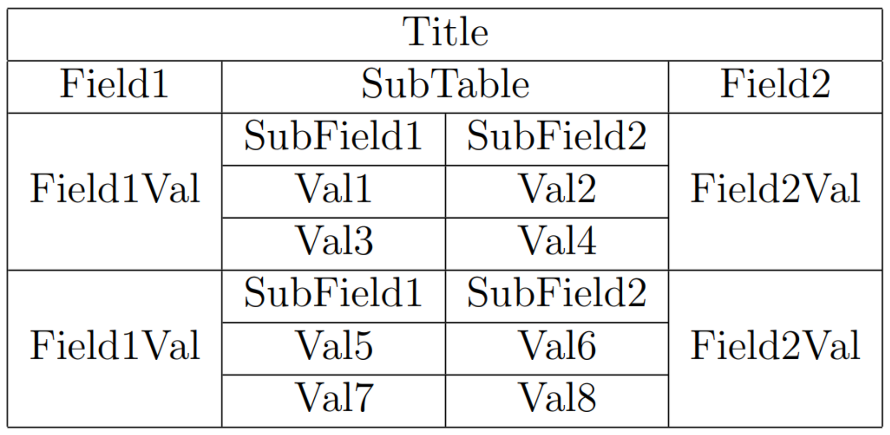
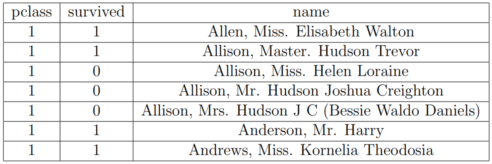

# Dataframe extension to export dataframes to LaTeX tables

Project adds a new extension function for AnyFrame called `toLatex` that export dataframe to LaTeX table.

`toLatex` returns `String` representing LaTeX table and has 3 arguments:
* `rowsLimit` - limits the number of rows that should be present in resulted LaTex table
* `precision` - determine with how many digits after point should float values be rendered 
* `borders` - `true` when returned table should have outer borders, `false` when not

The main code is written in [Latex.kt](/src/main/kotlin/Latex.kt). In [RenderUtils.kt](src/main/kotlin/RenderUtils.kt) there is
a number of util functions for rendering that were copied from DataFrame library internals and slightly modified.

Here is some examples:
<table>
<tr>
<th>Source</th>
<th>Rendered result</th>
</tr>
<tr>
<td>

```json
{
  "Title": [
    {
      "Field1": "Field1Val",
      "SubTable": [
        { "SubField1": "Val1", "SubField2": "Val2" },
        { "SubField1": "Val3", "SubField2": "Val4" }
      ],
      "Field2": "Field2Val"
    },
    {
      "Field1": "Field1Val",
      "SubTable": [
        { "SubField1": "Val5", "SubField2": "Val6" },
        { "SubField1": "Val7", "SubField2": "Val8" }
      ],
      "Field2": "Field2Val"
    }
  ]
}
```

</td>
<td>

</td>
</tr>
<tr>
<td>

```csv
pclass,survived,name
1,1,"Allen, Miss. Elisabeth Walton"
1,1,"Allison, Master. Hudson Trevor"
1,0,"Allison, Miss. Helen Loraine"
1,0,"Allison, Mr. Hudson Joshua Creighton"
1,0,"Allison, Mrs. Hudson J C (Bessie Waldo Daniels)"
1,1,"Anderson, Mr. Harry"
1,1,"Andrews, Miss. Kornelia Theodosia"
```

</td>
<td>

</td>
</tr>
</table>

More examples are in [LatexTest.kt](/src/test/kotlin/LatexTest.kt).
